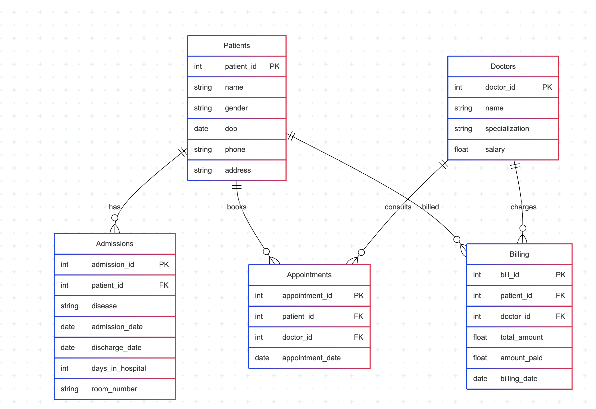

# Hospital-DataAnalysis
 🏥 A SQL-based Hospital Management System to manage patients, doctors, appointments, admissions, and billing. Includes ER diagram, table schemas, and sample queries. Designed for database practice, normalization, and relational data handling.

## 📂 Files Included

- **SQL_Hospital_Data_Model.mmd.rtf** – Mermaid syntax for ER diagram
- **erdiagrams.png** – PNG image of the ER diagram
- **README.md** – Project documentation

---

## 📊 ER Diagram



---

## 🗃️ Tables Overview

- **Patients** – Personal info of patients
- **Doctors** – Doctor details and specialization
- **Appointments** – Records of doctor-patient consultations
- **Admissions** – Data on patient stay, reason, and duration
- **Billing** – Total charges and payments

---

## 🧪 Sample Queries

```sql
-- Total patients treated by each doctor
SELECT d.name, COUNT(a.patient_id) AS patient_count
FROM Doctors d
JOIN Appointments a ON d.doctor_id = a.doctor_id
GROUP BY d.name;

-- Billing details of each patient
SELECT p.name, b.total_amount, b.amount_paid
FROM Patients p
JOIN Billing b ON p.patient_id = b.patient_id;
